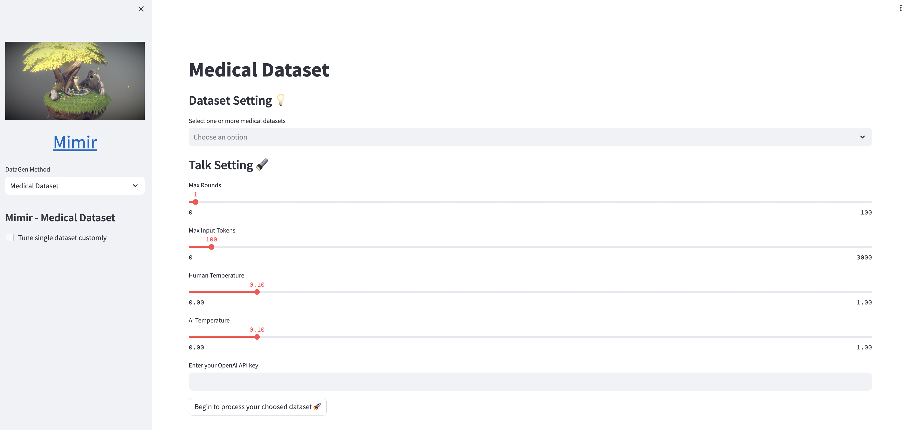
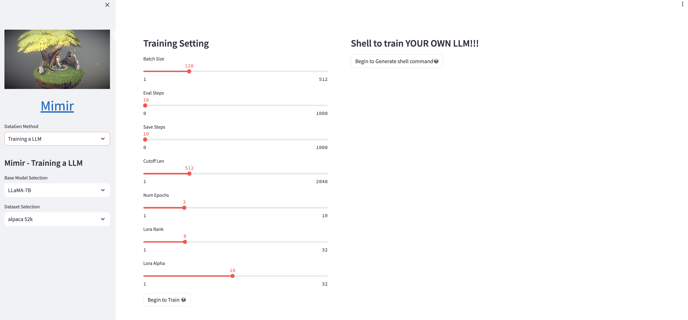

# Mimir
<p align="center">

</p>
<p align="center"><a href="">[📄 Paper (Coming Soon)]</a> | <a href="http://54.175.116.207:8501/">[🤗 Demo]</a> | <a href="https://youtu.be/8ZbfMFxMi8w">[🎬 Video]</a> </p>
<hr>

# What is Mimir?
*In Norse mythology, Mímisbrunnr, the Well of Wisdom, symbolizes the idea that models can draw knowledge from various domains and generate specialized datas for different fields, much like how Odin gained wisdom from the Well of Mímir.*

**Mimir is a medical domain multi-turn dialogue data generation tool based on ChatGPT. It supports multi-agent dialogues, allowing users to generate data for instruction tuning using publicly available medical domain datasets. Users can also upload their own knowledge documents to generate dialogue datasets based on those documents. Mimir supports dialogue verification, where each generated data is double-checked to ensure the accuracy of knowledge. Additionally, it supports fine-tuning, enabling users to deploy the platform on their own machines or utilize our provided fine-tuning scripts for training.**

## Deploy

```bash
1. Download the repo
2. pip install -r requirements.txt
4. cd conf/ && cp config_template.py config.py
5. fill the openai key in the config.py
3. streamlit run mimir/app.py
```

## How to generate data?

<p align="center">
  
</p>

## How to generate data based on own data file?

<p align="center">
  
</p>

## How to fineturn using our data?

<p align="center">
  
</p>

## Citation
If you find Mimir useful, please cite the following reference:
```bibtex

```
